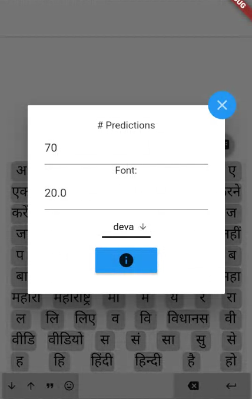

# Keyboard Oracle

A dynamic keyboard made using [Flutter](https://flutter.dev/).

A dynamic grid made up of buttons which functions as a keyboard. This keyboard changes
dynamically depending on the input to display the most likely aksaras (grapheme clusters)
to come next. The keyboard displays predictions of lengths 1-4.

All example word-frequency lists have been retrieved from the [Dakshina data set](https://github.com/google-research-datasets/dakshina).

## Setting up Flutter and Dart:
Install Flutter: Instructions are here: https://flutter.dev/docs/get-started/install

In summary:

1. Extract the file found in the link above to your desired location, e.g. `${USER}/${FOLDER}`.
2. Add Flutter to your path (e.g. by typing `export PATH="${PATH}:${PWD}/flutter/bin"` into the Linux command line).
3. To add Flutter to your path permanently, see instructions in the link above.
4. Type `flutter doctor` into the command line to make sure everything has been installed smoothly.

Flutter comes with a Dart SDK so you do not need a separate download for this.

## Setting up an IDE:
Flutter projects can be worked on in your IDE of choice. Flutter does, however,
requires an installation of [Android
Studio](https://developer.android.com/studio) to supply its Android platform
dependencies.  On the other hand, the pure Dart package we use cannot be created
in Android Studio.  Therefore, instructions for setting up both Android Studio
and Visual Studio Code are given below.

###### Android Studio:
1. Download and install from here: https://developer.android.com/studio
2. Start Android Studio and go through the *Android Studio Setup Wizard*.
3. On the Android Studio homepage click *Configure* and then *Plugins* and search for Flutter.

###### Visual Studio Code:
1. Install VS Code from here: https://code.visualstudio.com/
2. Start VS Code and install the Dart and Flutter plugins by going to *View > Command Palette* (or Ctrl + Shift + P).
3. Type *install*, and then select *Extensions: Install Extensions*.
4. Type *Flutter* and click install. This installs both the Dart and Flutter plugins.

## Setting up an emulator/device:
Instructions can be found here for Android: https://flutter.dev/docs/get-started/install

## Setting up the Dart package
1. Go to *View > Command Palette* in VS Code and choose *Dart: New Project*.
2. Select *Console Application* (console-full) and name your project trie_constructor.
3. Take note of where you store the project directory.
4. Overwrite *lib* and *bin* with the *lib* and *bin* files in *trie_constructor* directory in this repository.
5. Make sure your *pubspec.yaml* contains the same dependencies as the *pubspec.yaml* file in *trie_constructor* directory in this repository.
6. Run `pub get` in your terminal.

## Setting up the Protocol Buffer compiler and Dart plugin
1. Download and extract the appropriate protoc from here: https://github.com/protocolbuffers/protobuf/releases/tag/v3.12.4 .
2. Other possible ways of installing the compiler for Linux and Mac can be found here: https://github.com/dart-lang/protobuf/tree/master/protoc_plugin#hacking
3. As instructed in the downloaded README, add the protoc binary location to your path.
4. To download the Dart protoc plugin, instructions can be found here: https://github.com/dart-lang/protobuf/tree/master/protoc_plugin .
5. In a terminal, navigate to *trie_constructor/lib* and then enter `protoc --dart_out=. ./suffix_trie.proto`.
6. If you ever make changes to the *suffix_trie.proto* file, repeat step 5.

## Setting up the Flutter app
1. Create a new Flutter project (application) named *keyboard_oracle* in Android Studio.
2. Delete the default *test* folder and copy-paste the files in the *assets* folder from this repository.
3. This data is just placeholder data. You can replace it with your own, which can be generated using the dart package provided.
4. Overwrite the project's *pubspec.yaml* file with the one from this repository.
5. Find the comment in *pubspec.yaml* looking for a local path and replace it with the path to the directory of your Dart package.
6. Overwrite the project's *lib* folder with the one from this repository.
7. To run the app, select an emulator/device and run Flutter main.

## Using the Dart package to construct a new trie
1. Go to terminal, navigate to *trie_constructor/bin* and enter `dart trie_constructor.dart`. This constructs a trie from the default text file (*hi_examples.txt*) and stores it in *hi_trie.bin* .
2. If you would like to change the input text file to a different text file, enter `dart trie_constructor.dart --inputFile=[filepath]`. For example: `dart trie_constructor.dart --inputFile=ml_examples.txt` .
3. If you would like to change the output binary file location, enter `dart trie_constructor.dart --outputFile=[file path]` .
4. For input files, the script needs text files containing words where each word is separated by aksara and followed by its frequency in the form of: *[Aksara1][space symbol][Aksara2][space symbol][Aksara3][tab symbol][frequency no.]* .
5. If you would like to run performance tests on your language model, use the command line flag *isTest*. E.g. `dart trie_constructor.dart --isTest` . The results will be printed to your console.
6. You can now copy the generated bin file from *trie_constructor/bin* and paste them into the *assets* folder in your flutter app to use.
